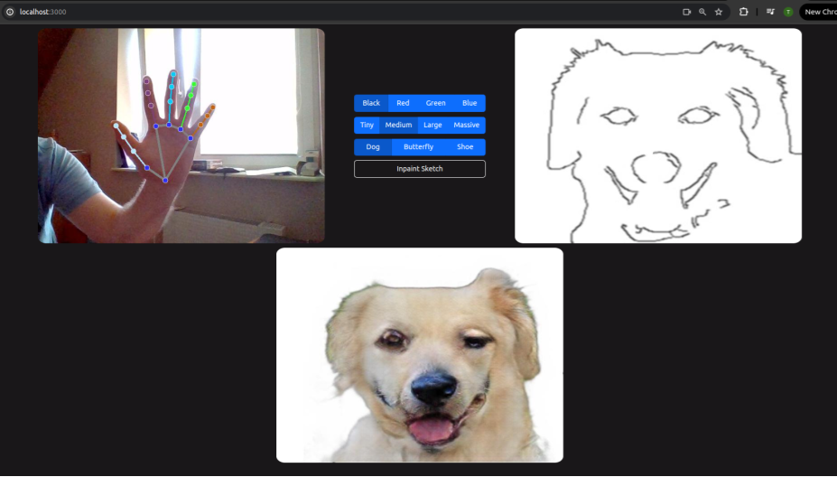

# API for VirtualPaint with GAN sketch inpainting

## About project
VirtualPaint is a web application enabling users to draw images using hand gestures. It captures and processes camera frames in real-time with a gesture detection model performing assigned actions based on detected gestures.

Additonaly it allows user to inpaint created sketches using 3 pre-trained GAN models.




## Hand gestures - actions
* forefinger - paint
* peace - draw a rectangle
* rock - draw a circle
* stop - erase
* 3 fingers - change marker color
* 4 fingers - change marker thickness
* fist - no action

## Endpoints description 
* ```/virtual_paint``` [WebSocket] - captures real-time camera frames and draws sketches based on hand gestures and position
* ```/fill_sketch``` - inpaint a sketch using a selected GAN model

# Installation and Configuration
1. Clone 2 repos: [Backend](https://github.com/SawaniX/InteractivePaint) and [Frontend](https://github.com/SawaniX/InteractivePaintFrontend)
2. Download GAN models and hand recognition model
3. Prepare .env file based on the templete.env
4. Run Frontend using ```npm start```
5. Run Backend using ```uvicorn main:app```
6. Enter ```localhost:3000```
